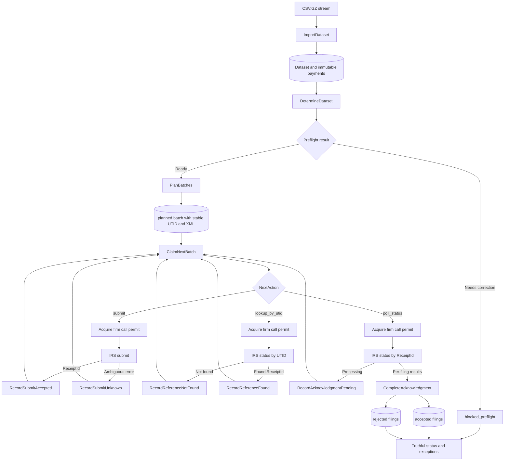

# PostgreSQL Data Model and Storage Boundary: Formal Specification

Status: Draft for implementation review
Date: 2026-08-30
Target: PostgreSQL 18.4 and `github.com/jackc/pgx/v5`
Companions: [Project requirements](../docs/README.md),
[system specification](../docs/formal-draft-spec.md), and
[research decisions](../docs/research-and-decisions.md)

## 1. Scope

This document defines the application database, schema migration rules, and the
Go storage boundary. It covers only durable facts required for import,
determination, transmission recovery, rate limiting, and truthful status.

Numbered SQL migrations are authoritative for exact SQL. This document is
authoritative for required tables, constraints, transaction boundaries, RLS,
and the API exposed by `internal/store`.

The words MUST, MUST NOT, SHOULD, SHOULD NOT, and MAY are normative.

## 2. Code and migration boundary

```text
db/migrations/      forward-only numbered SQL, run with psql
internal/domain/    money, identities, rules, and states
internal/app/       orchestration, data lifecycle interfaces, and API DTOs
internal/store/     all pgx usage, SQL queries, and transactions
internal/importer/  gzip and CSV streaming
internal/filing/    filing workflow and IRS calls
internal/status/    status and exception use cases
```

Only `internal/store` MAY import `pgx` or contain application SQL. Migration SQL
MUST remain under `db/migrations` and MUST run separately from the application.
Application startup checks the schema version but does not apply migrations.

The orchestration layer owns the PostgreSQL-agnostic data lifecycle interfaces.
`*store.Store` implements them. Domain and orchestration code MUST NOT import
`internal/store`; only the composition root constructs the concrete store. No
generic repository is needed.

The store API MUST NOT expose pgx types, SQL strings, table names, database error
codes, or caller-managed transactions.

## 3. Schema changes

Migration files use a monotonic number and description:

```text
db/migrations/000001_initial.sql
db/migrations/000002_<change>.sql
```

Applied migrations MUST never be edited or reordered. A correction is a new
migration. Each file runs in one transaction with `psql` and records itself in:

`schema_migrations`

- `version bigint PRIMARY KEY`
- `name text NOT NULL UNIQUE`
- `applied_at timestamptz NOT NULL DEFAULT transaction_timestamp()`

The migration command MUST use `psql -v ON_ERROR_STOP=1` and the migration-owner
DSN. The application role receives `SELECT` only on `schema_migrations`.
`store.Open` MUST fail with `ErrSchemaVersion` unless the latest applied version
matches the version required by the binary.

The local migration and application DSNs, container commands, and credentials
are documented in the
[system specification](../docs/formal-draft-spec.md#61-local-postgresql-test-instance).

### 3.1 Local commands

From `postgres/`, with `readiness-postgres` running:

```sh
make migrate
make test
make test-race
make test-e2e
make test-live
```

`make test-e2e` uses the dedicated PostgreSQL instance and disposable databases
for migration tests. `make test-live` also requires the IRS stub at
`http://127.0.0.1:8081`. Both targets accept the DSN and IRS environment
overrides defined in the Makefile and lifecycle specification.

## 4. Database rules

- The migration role owns tables. The runtime role owns none and MUST be
  `NOSUPERUSER` and `NOBYPASSRLS`.
- Money is signed `bigint` cents. Floating point and PostgreSQL `money` are
  forbidden.
- SHA-256 values are `bytea` constrained to 32 bytes.
- Durable workflow times are `timestamptz` populated from database time.
- States and reason codes are `text` with named check constraints.
- Foreign keys include `firm_id` wherever both tables are tenant-owned and use
  `ON DELETE RESTRICT`.
- Permanent source facts, filing identities, batch payloads, and filing results
  are immutable.
- Canonical XML is stored as `bytea`; payload JSON is not stored.

## 5. Tables and view

### 5.1 Import facts

`firms`

- `id text PRIMARY KEY`

`clients`

- `firm_id text`, `id text`
- Primary key `(firm_id, id)` and foreign key to `firms`

`datasets`

- Identity `id`, `firm_id`, `tax_year`, `content_sha256`, `source_row_count`,
  `imported_at`
- Unique `(firm_id, tax_year)` and `(firm_id, content_sha256)`
- Unique `(id, firm_id)` for composite foreign keys
- `source_row_count > 0`; rows are immutable

`payments`

- `dataset_id`, `source_row_number`, `firm_id`, `client_id`, `vendor_name`,
  nullable `vendor_tin`, `vendor_identity`, `payment_date`, `amount_cents`,
  `payment_method`, `backup_withholding_cents`, `memo`
- Primary key `(dataset_id, source_row_number)`
- Composite foreign keys to dataset and client
- Positive source row number, allowed payment method, and nonnegative
  withholding checks
- No runtime `UPDATE` or `DELETE` grant

Import uses a transaction-local temporary table with raw text columns. The store
streams rows into it with `COPY FROM STDIN`, validates with set-based SQL, and
inserts the dataset, clients, and payments in the same transaction. A failed or
interrupted import leaves no permanent rows. A firm/year advisory transaction
lock serializes concurrent imports.

### 5.2 Determination and filings

`determinations`

- Identity `id`, `dataset_id`, `firm_id`, `ruleset_version`, `completed_at`
- Unique `(dataset_id, ruleset_version)` and `(id, firm_id)`
- Composite foreign key to dataset; rows are immutable

A determination inserts all filing candidates and its completed marker in one
transaction. If the process stops, the transaction rolls back and can be run
again.

`payment_classification_nec_2025_v1` is the versioned SQL view used by both the
determination aggregate and payment explanation query. It returns each payment,
whether it counts, and the exclusion reason. A rule change creates a new view;
an applied versioned view is not replaced.

- `check`, `ach`, `wire`, and `cash` count.
- `credit_card` is excluded as `PAYMENT_PROCESSOR_REPORTED`.
- `paypal` is excluded as `THIRD_PARTY_NETWORK_REPORTED`.
- A vendor requires a filing when counted net amount is at least 60000 cents or
  total backup withholding across all payment methods is positive.

`filings`

- Identity `id`, `firm_id`, `client_id`, `determination_id`, `tax_year`,
  `vendor_identity`, `vendor_display_name`, nullable `recipient_tin`,
  `filing_key`, `reportable_cents`, `withholding_cents`, `state`, nullable
  `preflight_reason`, nullable `irs_record_id`, nullable `rejection_reason`,
  `created_at`, nullable `acknowledged_at`
- Unique global `filing_key`
- Unique `(firm_id, client_id, tax_year, vendor_identity)`
- Unique `(id, firm_id, client_id)` for composite foreign keys
- Composite foreign keys to determination and client
- State is `blocked_preflight`, `ready`, `batched`, `accepted`, or `rejected`
- A blocked filing requires `TIN_MISSING`, `TIN_MALFORMED`, `TIN_INVALID`, or
  `AMOUNT_INVALID` as its preflight reason and has no IRS result
- An accepted filing requires `irs_record_id` and no rejection reason
- A rejected filing requires one of the same four exhaustive reason codes and
  no IRS record ID
- Identity, amounts, and terminal result fields are immutable

No separate exception table or status cache is allowed. Exceptions and client
status are SQL projections from filings and batches.

### 5.3 Submission work

`submission_batches`

- Identity `id`, `firm_id`, `client_id`, `tax_year`, deterministic `utid`,
  `canonical_xml`, `payload_sha256`, `state`, nullable `receipt_id`,
  `next_action_at`, `attempt_count`, nullable `lease_owner`, nullable
  `lease_expires_at`, nullable `submitted_at`, nullable `acknowledged_at`,
  nullable `retry_exhausted_at`, nullable sanitized `last_error_code`
- Unique `(firm_id, utid)` and unique `receipt_id` when non-null
- Unique `(id, firm_id, client_id)` for composite foreign keys
- Composite foreign key to client
- State is `planned`, `submitting`, `submit_unknown`, `submitted`,
  `awaiting_ack`, `acknowledged`, or `invariant_failed`
- Lease owner and expiry are both null or both non-null
- UTID, canonical XML, payload hash, firm, client, and tax year are immutable

`batch_filings`

- `batch_id`, `filing_id`, `firm_id`, `client_id`, `slot`
- Primary key `(batch_id, filing_id)`
- Unique `filing_id` and unique `(batch_id, slot)`
- Slot is from 1 through 100
- Composite foreign keys to batch and filing enforce one firm and client

The batch row and all links are inserted in one transaction. Acknowledgment
updates every filing result and the batch state in one transaction; incomplete,
duplicate, or unknown results roll back.

### 5.4 Rate limiting and audit

`rate_gates`

- `firm_id PRIMARY KEY`, `next_call_at`, `crash_fence_until`, `updated_at`
- Foreign key to firm

`api_call_log`

- Identity `id`, `firm_id`, nullable `batch_id`, `operation`, `started_at`,
  nullable `completed_at`, nullable `outcome`, nullable `http_status`, nullable
  sanitized `error_code`
- Operation is `submit` or `status`
- Foreign keys to firm and batch
- One intent row is inserted before I/O; completion fields may be filled once;
  rows are never deleted

One dedicated database connection holds the firm advisory session lock across
one IRS call. Short transactions record the intent and crash fence before I/O,
then the completion and next-call time after I/O. A process loss releases the
session lock but leaves the conservative fence durable.

## 6. Required indexes

- `payments (dataset_id, client_id, vendor_identity)` including amount, method,
  withholding, and vendor name for determination
- `submission_batches (next_action_at, lease_expires_at, id)` partial for
  nonterminal states
- `filings (firm_id, client_id, state)` for status
- `filings (rejection_reason)` partial for rejected filings
- `api_call_log (firm_id, started_at DESC)` for rolling-rate checks

Primary and unique constraints supply the remaining indexes. Add no other index
without a query that needs it.

## 7. Tenant isolation

Every tenant table MUST carry a firm identity, enable RLS, and force RLS. For
`firms`, the row identity is `id`; for other tables it is `firm_id`.

Each store transaction sets validated firm context with a parameterized call:

```sql
SELECT set_config('app.firm_id', $1, true);
```

Policies compare the row firm with the transaction-local setting. Missing
context matches no rows. Worker mutations also include explicit `firm_id`
predicates. Composite foreign keys reject cross-firm links independently of
RLS. Tests MUST prove that pooled connections do not retain firm context after
commit or rollback.

## 8. Data lifecycle API

### 8.1 Boundary

The orchestration layer depends on a `DataLifecycle` port composed from five
narrow interfaces. The API uses `context.Context`, domain value types, and the
DTOs below. It exposes no PostgreSQL or pgx type.

```go
type DataLifecycle interface {
  ImportLifecycle
  DeterminationLifecycle
  FilingLifecycle
  RateLifecycle
  StatusLifecycle
}
```

The concrete `internal/store.Store` is concurrency-safe and backed by a bounded
pool. Its constructor verifies connectivity and schema version before it is
passed to orchestration.

Orchestration tests MUST run against a fake `DataLifecycle` without PostgreSQL,
pgx, SQL fixtures, or store imports. The composition root is the only code that
knows which implementation is PostgreSQL-backed.

### 8.2 Import and determination

```go
type ImportLifecycle interface {
  ImportDataset(context.Context, ImportDatasetCommand, PaymentRowSource) (DatasetResult, error)
}

type DeterminationLifecycle interface {
  DetermineDataset(context.Context, DetermineDatasetCommand) (DeterminationResult, error)
  PaymentExplanation(context.Context, PaymentExplanationQuery) (PaymentExplanation, error)
}
```

`ImportDatasetCommand` contains firm ID and tax year. `PaymentRowSource` is a
bounded pull source that yields source row number and the eight raw CSV fields,
then exposes the decompressed-stream SHA-256 after EOF. It is not a slice and
does not expose `pgx.CopyFromSource`.

`DatasetResult` contains dataset ID, content hash, row count, and `Existing`.
Replaying matching content returns the existing result. Different content for
the same firm/year returns `ErrConflict`.

`DetermineDatasetCommand` contains firm ID, dataset ID, and ruleset version.
`DeterminationResult` contains determination ID and filing counts by ready and
blocked state. Replaying the same dataset/ruleset returns the existing result.
`PaymentExplanationQuery` contains firm ID, determination ID, client ID, and
vendor identity; its result contains each payment, counted/excluded status,
reason, and aggregate totals.

### 8.3 Filing workflow

```go
type FilingLifecycle interface {
  PlanBatches(context.Context, PlanBatchesCommand) (BatchPlanResult, error)
  ClaimNextBatch(context.Context, ClaimBatchCommand) (BatchWork, bool, error)
  RecordSubmitAccepted(context.Context, Claim, SubmitAccepted) error
  RecordSubmitUnknown(context.Context, Claim, RetrySchedule) error
  RecordReferenceFound(context.Context, Claim, ReferenceFound) error
  RecordReferenceNotFound(context.Context, Claim, RetrySchedule) error
  RecordAcknowledgmentPending(context.Context, Claim, RetrySchedule) error
  RecordStatusUnavailable(context.Context, Claim, RetrySchedule) error
  CompleteAcknowledgment(context.Context, Claim, []FilingOutcome) error
  RecordRetryExhausted(context.Context, Claim, FailureCode) error
  FailBatchInvariant(context.Context, Claim, FailureCode) error
}
```

`PlanBatchesCommand` contains firm ID and determination ID.
`BatchPlanResult` contains existing and created batch counts. Planning is
idempotent and never moves a filing already assigned to a batch.

`ClaimBatchCommand` contains firm ID, worker ID, and lease duration.
`ClaimNextBatch` returns `found=false` when no work is due. `BatchWork` contains:

- an opaque `Claim` used to fence every transition;
- batch, firm, client, and tax-year identities;
- next action: `submit`, `lookup_by_utid`, or `poll_status`;
- stable UTID, canonical XML, and payload hash; and
- ReceiptId when known.

The orchestration layer selects the IRS client call from `NextAction`; it does
not inspect or set database state. Retry schedules are durations, not wall-clock
timestamps. The store computes durable due times from database time.

Each transition method accepts only the data produced by its external event:

- `SubmitAccepted` contains ReceiptId and poll delay.
- `ReferenceFound` contains ReceiptId and poll delay.
- `RetrySchedule` contains retry delay and sanitized failure code.
- `FilingOutcome` contains filing key plus either accepted IRS record ID or one
  rejection reason.

`RecordSubmitUnknown` always schedules UTID lookup. `RecordReferenceNotFound`
may return the same immutable batch to submission. No API accepts an arbitrary
target state, UTID, payload, filing set, or replacement batch identity.

### 8.4 Rate permit

```go
type RateLifecycle interface {
  AcquireCallPermit(context.Context, AcquireCallCommand) (CallPermit, error)
}

type CallPermit interface {
  Finish(context.Context, CallResult) error
  Close() error
}
```

`AcquireCallCommand` contains firm ID, batch ID, and operation (`submit` or
`status`). Acquisition waits until the shared firm budget allows one call,
records call intent and a conservative crash fence, and returns an opaque
permit. Orchestration MUST call `Finish` once after the HTTP attempt and MUST
defer `Close`. `CallResult` contains outcome, optional HTTP status, and sanitized
error code. Outcome is `completed`, `ambiguous`, `retryable_error`, or
`terminal_error`. Closing an unfinished permit preserves the crash fence.

The permit hides the dedicated connection and advisory lock. It authorizes
exactly one IRS call and MUST NOT be reused or shared.

### 8.5 Status queries

```go
type StatusLifecycle interface {
  FirmStatus(context.Context, FirmStatusQuery) (FirmStatus, error)
  ClientStatus(context.Context, ClientStatusQuery) (ClientStatus, error)
  Exceptions(context.Context, ExceptionsQuery) ([]ExceptionGroup, error)
}
```

`FirmStatusQuery` contains firm ID. `ClientStatusQuery` contains firm and client
IDs. `ExceptionsQuery` contains firm ID and an optional client ID. `FirmStatus`
and `ClientStatus` contain required, blocked, ready, pending, accepted, and
rejected counts plus the derived headline state. `ExceptionGroup` contains a
stable exception type, count, and item summaries required for navigation; it
does not expose database rows.

### 8.6 Errors and transaction ownership

The API returns errors compatible with `errors.Is`:

| Error                  | Meaning                                                       |
| ---------------------- | ------------------------------------------------------------- |
| `ErrSchemaVersion`     | Binary and schema versions do not match                       |
| `ErrConflict`          | An idempotency identity exists with different immutable input |
| `ErrNotFound`          | A requested durable identity does not exist for the firm      |
| `ErrInvalidTransition` | The event is not legal from the current durable state         |
| `ErrStaleClaim`        | The opaque claim no longer owns the work                      |
| `ErrInvariant`         | Stored identity, payload, or result facts disagree            |

Errors MUST NOT include SQL, PostgreSQL codes, DSNs, TINs, memos, or canonical
XML. Cancellation and deadlines use standard context errors.

The store owns every transaction. Import, determination, batch planning, claims,
state transitions, and complete acknowledgment each commit atomically. No HTTP
call or orchestration callback runs in an ordinary transaction. The rate permit
holds only its opaque session lock during HTTP. A stale claim or state update
changes no rows and returns a typed error.

## 9. Acceptance evidence

| Requirement                         | Database or store proof                                                                                  |
| ----------------------------------- | -------------------------------------------------------------------------------------------------------- |
| Versioned schema                    | Fresh migration, one-version upgrade, and failed-migration rollback tests                                |
| Import idempotency and interruption | Same-file replay, concurrent import, and forced rollback tests                                           |
| Flat import memory                  | Streaming source and 1x/4x RSS test                                                                      |
| Firm isolation                      | RLS read/write/link tests using the non-owner role and pooled connections                                |
| Correct determination               | Six required situations, boundary amounts, and explanation query tests                                   |
| Zero duplicate filing intent        | Filing identity, filing key, UTID, and one-batch-per-filing unique constraints                           |
| Crash recovery                      | Batch transition and process-restart E2E tests against the live stub                                     |
| At most 100 filings per client      | Slot checks, composite keys, and batch planner test                                                      |
| Immutable acknowledgment            | Malformed result-set rollback and terminal-result update rejection tests                                 |
| Shared 20/60 firm budget            | Concurrent rate-permit test and rolling `api_call_log` query                                             |
| Truthful status                     | Projection precedence tests before and after worker restart                                              |
| Performance                         | Import, determination, and status budgets from the project requirements                                  |
| Clean storage boundary              | Core packages compile without SQL, pgx, or store imports; orchestration tests use a fake `DataLifecycle` |

## 10. Definition of done

The database boundary is complete when migrations create this model on a fresh
PostgreSQL 18.4 database, all acceptance evidence above passes using the
non-owner runtime role, and core packages access PostgreSQL only through their
small store interfaces.

## 11. Filing lifecycle architecture


